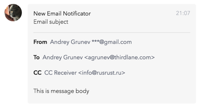

# Thirdlane Connect Email Webhook

This is a modified version of [Slack Email Webhook](https://github.com/bitfasching/slack-email-webhook) project by Nick Schwarzenberg to fit Thirdlane Connect requirenments. 
A possibility to check several mail accounts was added - you should specify an array of configs in config.js file. Each email goes in a separate notification.

A lightweight service to get notifications on [Thirdlane Connect](https://www.thirdlane.com/) for received and sent mail.

- connects to an IMAP account and posts as incoming webhook
- can be run as multiple instances to monitor more than one mailbox
- differentiates between received and sent mail

Written in ES2015 with [async](https://developer.mozilla.org/en-US/docs/Web/JavaScript/Reference/Statements/async_function)/[await](https://developer.mozilla.org/en-US/docs/Web/JavaScript/Reference/Operators/await) from ES2017. Requires [node.js](https://nodejs.org/en/download/current/) 7.6 or newer.


## Getting Started

How to set up your Thirdlane Email Webhook in 5 minutes.
You'll need:

- an email account with IMAP access
- manage webhook permissions for your Thirdlane Connect account
- a machine with a recent version of node.js to run your Thirdlane Email Webhook (root access not required)

This service has been tested on Debian and Ubuntu, but you should be able to set up your Thirdlane Email Webhook on any system capable of running node.js.

### Creating an Incoming Webhook

First create an incoming webhook for your Thirdlane Connect channel.
This will give you a URL where to send your email notifications.
While logged in, go to Settings › Integrations › Custom Integrations › Manage Incoming Webhooks and click Add Webhook.

Select a channel where you'd like to receive notifications and click “Save”.
You will be returned to the Manage Incoming Webhooks page where you will be able to find your new Webhook and copy its URL to clipboard.

### Installing & Configuration

On your machine, run [npm](https://docs.npmjs.com/) to get the [package](https://www.npmjs.com/package/thirdlane-connect-email-webhook) and its dependencies:

```
$ npm install thirdlane-connect-email-webhook
```

This will install a copy to your current directory under `node_modules/thirdlane-connect-email-webhook`.
Use `npm install --global` to make it available as sytem-wide command.

The file [`config-example.js`](config-example.js) contains an annotated example configuration.
Create a copy and name it `config.js`, then open it in a text editor.
The following settings need to be adjusted before the first run:

- *username* – IMAP username, usually your email address
- *password* – password to log into your email account
- *host* – your provider's IMAP server name (if in doubt, [search](https://duckduckgo.com/?q=imap+settings+yourproviderhere) for it)
- *webhookURL* – the URL of your new integration on Thirdlane Connect

### Quick Start

After configuring the credentials and the webhook URL, you're ready to start the service:

```
$ npm start

> thirdlane-connect-email-webhook@0.1.0 start …
> node thirdlane-connect-email-webhook.js

2017-04-06 00:46 Connecting to imap.gmx.net:993…
2017-04-06 00:46 Selected mailbox "INBOX" containing 3773 mail(s).
2017-04-06 00:46 No unread mails to fetch.
```

In this example, the inbox didn't contain any unread messages.
The service will stay connected to your IMAP account and listen for updates.
A notification will be triggered for any new message.
You can send one or move one from another folder, e.g. from trash.

```
2017-04-06 00:56 Fetching 1 new mail(s)…
2017-04-06 00:56 Sent a notification to Thirdlane Connect.
```



You should have received a notification in Thirdlane Connect!

Press Ctrl+C to stop the service:

```
2017-04-06 00:57 SIGINT, logging out…
2017-04-06 00:57 Exiting…
```

### Running Permanently

A convenient way to run the service permanently is to use some kind of process manager like [pm2](https://www.npmjs.com/package/pm2).
It's able to run your Thirdlane Email Webhook after booting and restart it after unrecoverable runtime errors.

If you don't want to use a third-party process manager, you may as well start Thirdlane Email Webhook manually, redirect its outputs to a log file and put it into background.
In a POSIX-compliant terminal, you could do the following:

```
$ node thirdlane-connect-email-webhook.js >> somename.log 2>&1 &
[1] 25978
```

You get the process' job number and its PID. To bring a process to foreground, use `fg %JOBNUMBER`. To gracefully shut down the service while it's in the background, send a SIGINT signal to its PID:

```
$ kill -INT 25978
```


## Details

### Configuration File

The sample configuration file [`config-example.js`](config-example.js) contains comments for every setting, which should be self-explanatory.
Every key must have a valid value; they will neither be checked nor completed with defaults.
The configuration file is executed and imported as a module using node's `require()`.

### Environment Variables

Two environment variables are considered during start:

- `CONFIG`: Absolute or relative path to the configuration file. Defaults to “./config.js”.

### Process Interface

Thirdlane Email Webhook…

- ignores any command line arguments
- ignores any input via `stdin`
- writes informational messages to `stdout`
- writes error messages to `stderr`
- logs out and exits gracefully on SIGINT signal
- does not return any special exit codes

## Examples

### Exploring Available Mailboxes

Usually an IMAP account comprises several mailboxes (folders).
The mailbox for incoming mail is commonly called “INBOX”, which is the default mailbox monitored by Thirdlane Email Webhook.
To watch another mailbox, e.g. for sent mail, either specify its name in `config.js` or pass it as environment variable `MAILBOX` when starting the service.

Mailbox names are not standardized.
It's common to store sent mails in “Sent” for example, but this name may vary from client to client, especially in non-English language environments.
Thirdlane Email Webhook retrieves a list of existing mailboxes from the server and checks if the mailbox you wanted is available.
In case it's not, the list is shown in the log.
You may use this to explore the available mailboxes in your account:

```
$ MAILBOX=? node thirdlane-connect-email-webhook.js
2017-04-16 16:48 Connecting to posteo.de:993…
2017-04-16 16:48 Wanted mailbox "?" is not available.
2017-04-16 16:48 Available mailboxes: "Drafts", "Trash", "Sent", "Notes", "INBOX"
2017-04-16 16:48 Exiting…
```

### Two Instances for Received & Sent Mail

You can add multiple configurations in your config.js file with different Webhook URLs - all of them will be checked and notifications will be posted by the script.
